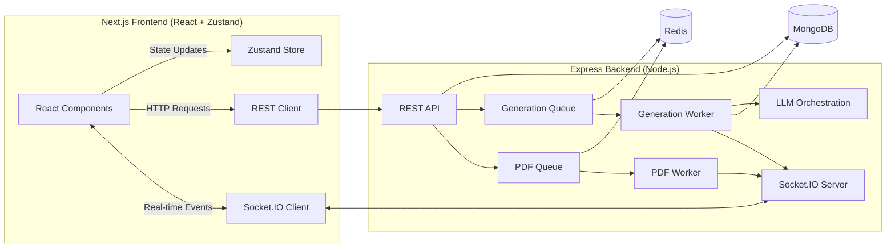

# 🏆 VedaAI — Next-Gen AI Assessment Creator

Welcome to **VedaAI**, a production-grade, highly scalable web application designed to revolutionize how educators create, analyze, and manage assessments. 

This is not just another wrapper around an LLM. It is a full-stack, real-time, asynchronous processing engine built with strict typing, robust message queuing, and an obsessive focus on User Experience (UX) and Product Design. 

---

## ✨ "Wow" Features — The Standouts

While the core functionality (creating assignments, generating PDFs) is fully implemented to spec, the true power of this submission lies in its advanced features that showcase deep product intuition:

1. **🧠 Smart Regeneration with AI Diff Viewer**
   - Teachers rarely want to re-read an entire generated paper to find out what the AI changed. 
   - **How it works:** When regenerating, the UI displays a side-by-side **visual diff** (highlighting additions in green and removals in red) between the previous version and the new one. 
   
2. **📊 Pedagogical Paper Analytics (Bloom's Taxonomy)**
   - Creating a paper isn't enough; teachers need to know if the paper is *balanced*.
   - **How it works:** A bespoke Recharts-powered dashboard analyzes the generated paper to extract **Bloom's Taxonomy Cognitive Levels** (Remember, Understand, Apply, Analyze), alongside a Difficulty Distribution Pie Chart and a Marks-by-Difficulty Bar Chart.

3. **A/B 🔀 Exam Variants (Set A & Set B)**
   - To prevent cheating, teachers often need multiple variants of the same exam with the exact same difficulty and structure.
   - **How it works:** A single toggle during creation prompts the AI to generate **two distinct but perfectly parallel papers** simultaneously. The UI provides a seamless tabbed view to switch between Set A and Set B.

4. **🌍 Deep Multi-Language Support**
   - True accessibility means supporting local languages natively.
   - **How it works:** Generates exams strictly in **English, Hindi, or Bilingual (English + Hindi)**, enforcing rigorous prompt boundaries so the AI adheres strictly to the chosen language.

5. **🔒 Targeted Question Locking**
   - Teachers often like *most* of a generated paper but want to change just a few questions without losing the good ones.
   - **How it works:** Users can click a "Lock" icon next to any generated question. When regenerating the paper with new instructions, the AI is dynamically prompted to perfectly retain the locked questions while rewriting the rest.

6. **⚡ Enterprise-Grade Caching & State Management**
   - **How it works:** The frontend uses **Zustand** for aggressive client-side caching, instantly reflecting updates without redundant API calls. The backend leverages **Redis** to orchestrate asynchronous tasks, ensuring the database is protected from unnecessary load and that the application feels instantly responsive.

7. **⏳ Time Travel (Version History & Restoration)**
   - LLMs can hallucinate or produce regressions. Teachers need a safety net.
   - **How it works:** Every generation is saved as a discrete version. A persistent right-hand sidebar tracks the history, allowing the user to seamlessly "Rollback" to any previous version of the paper with one click.

8. **📄 Modular Multi-Format Export (PDF & DOCX)**
   - Teachers rarely want an inflexible output. They often need to tweak margins in Word or print just the Answer Key for themselves.
   - **How it works:** A browser-side robust export engine allows users to download the assignment as a highly styled **PDF** or a natively editable **MS Word (.docx)** file. It also supports modular downloads: Question Paper only, Answer Key only, or Both.

---

## 🏗️ System Architecture

Built for scale, the architecture aggressively separates the fast, synchronous HTTP lifecycle from the slow, non-deterministic AI generation lifecycle.



### 🧠 The Generative Pipeline
1. **Request Intake:** `POST /api/assignments` validates the input via Zod and instantly returns a `202 Accepted`, dropping a job into the Redis-backed **BullMQ**.
2. **Context Extraction:** The Generation Worker extracts text from uploaded study material (`.pdf` via `pdftotext`, `.txt`).
3. **LLM Orchestration:** The payload is injected into an advanced prompt chain. We use **OpenRouter (Nvidia Nemotron / Gemini Fallback)**.
4. **Structured Output Enforcement:** The LLM output is piped through a strict **Zod Schema parser**. If the AI hallucinates bad JSON, it is caught and handled, ensuring the UI *never* breaks.
5. **Real-Time Push:** Socket.IO pushes an `assignment.ready` event to the client. Zustand instantly merges the new paper into the global state, triggering a reactive UI update without polling.

---

## 🛠️ Tech Stack & Tooling

- **Frontend:** Next.js 14 (App Router), React 18, TypeScript, Tailwind CSS, Zustand, Recharts, `react-hot-toast`, `diff`.
- **Backend:** Node.js, Express, TypeScript, Mongoose (MongoDB), BullMQ, IORedis, Socket.IO, Puppeteer (for server-side PDF generation), Zod.
- **AI/LLM:** Configurable Adapter Pattern (`mock`, `openrouter`, `gemini`).

---

## 🚀 Quick Start Guide

### Prerequisites
- Node.js 20+
- Docker (for MongoDB + Redis)

### 1. Boot up Infrastructure (Mongo & Redis)
```bash
cd backend
docker compose up -d
cp .env.example .env
```
*(Redis maps host port 6380 → container 6379 to avoid local conflicts).*

### 2. Start the Backend API & Workers
```bash
cd backend
npm install
npm run dev
```
- **API:** http://localhost:4000
- **Health Check:** http://localhost:4000/health

### 3. Start the Next.js Frontend
```bash
cd frontend
npm install
cp .env.local.example .env.local
npm run dev
```
- **App:** http://localhost:3000

---

## 🧪 Testing & Validation

The backend boasts a suite of Vitest-powered unit tests validating the LLM Adapter schemas, ensuring that generated JSON always maps perfectly to the TypeScript interfaces.

```bash
cd backend
npm run test       # Run LLM schema validation tests
npm run typecheck  # Run strict TS compilation
```

---

## ☁️ Deployment

The application architecture relies on a separation of concerns for deployment:

- **Frontend (Next.js):** Deployed on **Vercel** for optimal Edge routing and static generation.
- **Backend (Node.js/Express):** Deployed on **Hugging Face Spaces (Docker)**. A custom GitHub Actions CI/CD pipeline (`.github/workflows/deploy.yml`) has been configured to automatically package the backend environment and sync it to Hugging Face on every push to `main`.
- **Infrastructure:** Powered by **MongoDB Atlas** (Database) and **Upstash Redis** (Job Queues/BullMQ).

---

## 💡 Design Decisions

1. **No Raw Markdown Parsing in UI:** Many AI apps just pipe `ReactMarkdown` to the screen. VedaAI enforces structured JSON generation, mapping exactly to React components (`Section`, `Question`, `AnswerKey`). This allows for semantic rendering, precise PDF exports, and deep analytics.
2. **BullMQ over HTTP Blocking:** LLM calls take 5-30 seconds. By offloading this to a Redis queue, the main Express thread remains perfectly unblocked, capable of handling thousands of concurrent users.
3. **Zustand over Context API:** Used Zustand for global state management to prevent unnecessary re-renders that plague React Context, ensuring buttery-smooth animations when transitioning between generating states.
4. **Adapter Pattern for LLMs:** The application is entirely agnostic to the AI provider. Switching between OpenAI, Gemini, or OpenRouter is as simple as flipping an environment variable, protecting the app from vendor lock-in.
