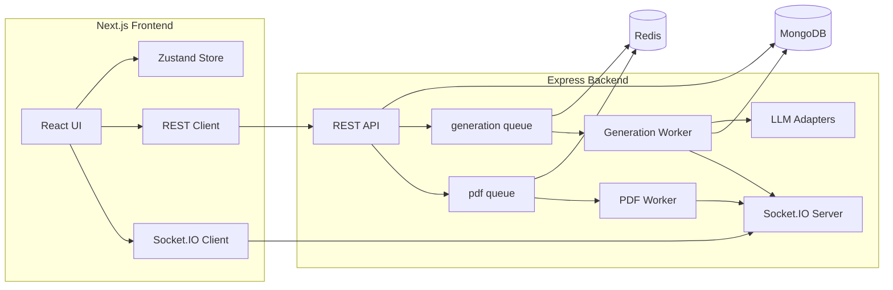

# VedaAI — AI Assessment Creator

Production-oriented full-stack app for the VedaAI hiring assignment. Teachers create assignments, AI generates structured question papers in the background, and the UI updates in real time via WebSockets.

## Features

| Area | Implementation |
|------|----------------|
| **Assignment form** | Due date, question types (count + marks), optional file upload (PDF/image/text), additional instructions, validation |
| **State** | Zustand (draft + list cache, persisted locally) |
| **AI generation** | Prompt → LLM → Zod parse (never raw LLM text in UI), with uploaded text/PDF material excerpted into the prompt |
| **Async jobs** | BullMQ workers (generation + PDF) |
| **Persistence** | MongoDB |
| **Cache / queue** | Redis + BullMQ |
| **Real-time** | Socket.IO (`assignment.*`, `pdf.*` events) |
| **Output page** | Exam-style paper, difficulty tags, student info lines, answer key |
| **Bonus** | Server PDF (Puppeteer), Regenerate, status badges, mobile nav |

## Architecture



### Generation flow

1. `POST /api/assignments` — validate input, save assignment (`status: queued`), enqueue BullMQ job.
2. Worker sets `generating`, emits `assignment.progress` over WebSocket.
3. Worker extracts uploaded study-material text (`text/plain` directly, `application/pdf` via `pdftotext` when available with a heuristic fallback), then sends that context to the LLM.
4. LLM adapter returns JSON; **Zod** validates → `QuestionPaper` stored, `status: ready`, `assignment.ready` emitted.
5. Output page subscribes to the assignment room and renders structured sections (not raw model text).

### PDF flow

1. `GET /api/assignments/:id/pdf` — if file exists, download; else enqueue Puppeteer job (`202`).
2. Worker renders `/print/paper/:id`, saves PDF, emits `pdf.ready` with URL.
3. Frontend downloads the blob when the event fires.

## Tech stack

- **Frontend:** Next.js 16, TypeScript, Tailwind CSS 4, Zustand, Socket.IO client
- **Backend:** Express, TypeScript, Mongoose, BullMQ, IORedis, Socket.IO, Puppeteer
- **LLM:** `mock` (default, no API key), or OpenAI / OpenRouter / Gemini / Anthropic

## Quick start

### Prerequisites

- Node.js 20+
- Docker (for MongoDB + Redis)

### 1. Infrastructure

```bash
cd backend
docker compose up -d
cp .env.example .env
```

Redis in compose maps **host port 6380** → container 6379 (see `REDIS_URL` in `.env.example`).

### 2. Backend

```bash
cd backend
npm install
npm run dev
```

API: http://localhost:4000  
Health: http://localhost:4000/health

### 3. Frontend

```bash
cd frontend
npm install
cp .env.local.example .env.local
npm run dev
```

App: http://localhost:3000

### Environment

**Backend** (`backend/.env`):

| Variable | Default | Notes |
|----------|---------|--------|
| `PORT` | 4000 | HTTP port |
| `CORS_ORIGIN` | http://localhost:3000 | Must match frontend origin |
| `MONGO_URI` | mongodb://localhost:27017/vedaai | |
| `REDIS_URL` | redis://localhost:6380 | Match docker-compose |
| `LLM_PROVIDER` | mock | Set `openai` / `openrouter` / `gemini` / `anthropic` + API key for real AI |
| `PUBLIC_BASE_URL` | http://localhost:4000 | Used by PDF worker |
| `OPENROUTER_API_KEY` |  | Required when `LLM_PROVIDER=openrouter` |

**Frontend** (`frontend/.env.local`):

| Variable | Default |
|----------|---------|
| `NEXT_PUBLIC_API_URL` | http://localhost:4000 |
| `NEXT_PUBLIC_WS_URL` | http://localhost:4000 |

## API overview

| Method | Path | Description |
|--------|------|-------------|
| GET | `/health` | Mongo + Redis status |
| GET | `/api/assignments` | List assignments |
| POST | `/api/assignments` | Create (multipart: `file` optional) |
| GET | `/api/assignments/:id` | Get one |
| DELETE | `/api/assignments/:id` | Delete |
| POST | `/api/assignments/:id/regenerate` | Re-queue generation |
| GET | `/api/assignments/:id/pdf` | Download or enqueue PDF |

### WebSocket events (subscribe with `subscribe(assignmentId)`)

- `assignment.queued`, `assignment.progress`, `assignment.ready`, `assignment.failed`
- `pdf.queued`, `pdf.ready`, `pdf.failed`

## Project layout

```
.
├── frontend/          # Next.js App Router UI
├── backend/           # Express API + workers
├── Web Screens/       # Figma reference exports
└── Mobile Screens/    # Figma reference exports
```

## Approach & design decisions

1. **Structured AI output** — The LLM must return JSON matching `QuestionPaperSchema`. The parser strips markdown fences; invalid payloads fail the job instead of breaking the UI.
2. **Jobs over blocking HTTP** — Generation can take seconds; BullMQ gives retries, backoff, and clean separation from the request thread.
3. **WebSockets for UX** — The output page shows progress without polling; PDF completion uses the same channel.
4. **Mock LLM by default** — Reviewers can run the full pipeline without API keys; swap `LLM_PROVIDER` for production AI.
5. **Material-aware prompting** — Uploaded study material is actually fed into generation now, instead of using filename hints only.
5. **Frontend cache** — Zustand mirrors the server for instant navigation; API + WS keep it in sync.

## Scripts

| Location | Command | Purpose |
|----------|---------|---------|
| backend | `npm run dev` | API + workers (watch) |
| backend | `npm test` | LLM unit tests |
| backend | `npm run typecheck` | TypeScript |
| frontend | `npm run dev` | Next dev server |
| frontend | `npm run build` | Production build |

## Deployment notes

- Set `CORS_ORIGIN` and `NEXT_PUBLIC_*` URLs to your deployed hosts.
- Run MongoDB and Redis as managed services or containers.
- Install Chromium dependencies for Puppeteer on the PDF worker host (or use a dedicated worker process).
- Use a real `LLM_PROVIDER` and API keys in production.

### OpenRouter quick setup

If you want a zero-cost NVIDIA-backed model through OpenRouter, set:

```bash
LLM_PROVIDER=openrouter
LLM_MODEL=nvidia/nemotron-3-nano-30b-a3b:free
OPENROUTER_API_KEY=your_openrouter_key
OPENROUTER_SITE_URL=http://localhost:3000
OPENROUTER_APP_NAME=VedaAI
```

OpenRouter also offers the free router model `openrouter/free` if you prefer automatic free-model selection over pinning a specific NVIDIA free model.

## Submission

- **Repo:** This repository  
- **Live demo:** Deploy frontend (e.g. Vercel) + backend (e.g. Railway/Render) with Mongo/Redis add-ons, or document local run via the steps above.

---

Built for the VedaAI Full Stack Engineering assignment.
